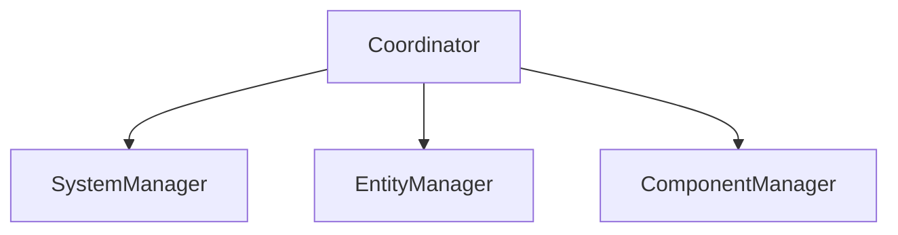

[](https://github.com/Vive-le-LEX/RTypeECS/actions/workflows/main.yml/badge.svg?branch=main)

## 📝 Description

This  project is our ECS implementation for the R-Type project. It is for now a header only library.

## Installation

### Requirements

- CMake 3.10 or higher
- A C++17 or higher compiler

If you want to build the documentation, you will need:

- Doxygen 1.10 or higher
- Graphviz 0.20.1 or higher

### Dependencies

Keep in mind that this project is header only, so you don't need to build it to use it. However, if you want to build the tests, you will need:
- [GTest](
    https://github.com/google/googletest
)

### Build

```bash
git clone
cd RTypeECS
cmake . -B build
cmake --build build
```

### Build the documentation

```bash
git clone
cd RTypeECS
cmake . -B build -DIS_BUILDING_DOC=ON
cmake --build build
```

### Build the tests

```bash
git clone
cd RTypeECS
cmake . -B build -DIS_BUILDING_TESTS=ON
cmake --build build
```

### Run the tests

```bash
cmake -P test.cmake
```


## 📚 Documentation

The documentation is available [here](https://vive-le-lex.github.io/RTypeECS/).

## How does it work ?



Our ECS is composed of 3 main parts:
- The `Coordinator` which is the main class of our ECS. It is the one that will be used by the user and is grouping the 3 other parts.

- The `SystemManager` which is the class that will manage the systems. It will be used to add, remove and update the systems.

- The `EntityManager` which is the class that will manage the entities. It will be used to create, destroy and get entities.

- The `ComponentManager` which is the class that will manage the components. It will be used to add, remove and get components.

The goal of the ECS is to keep all the data of the same type together (Components). This way, we can iterate over all the entities that have a specific component and apply a system on them.
This makes us able to have a better cache usage and to have hopefully better performances.

## 📝 Example

```cpp
#include <iostream>
#include <string>
#include <RType/ECS/Coordinator.hpp>

struct PositionComponent {
    int x;
    int y;
};

// A sample system that will move all the entities that have a position component
class MovementSystem : public RType::ECS::System {
public:
    MovementSystem() : RType::ECS::System() {}

    void update() final {
        for (auto& entity : _entities) {
            auto& position = _coordinator.getComponent<PositionComponent>(entity);
            position.x += 1;
            position.y += 1;
        }
    }
};

int main() {
    // First we create a coordinator
    RType::ECS::Coordinator coordinator;

    // With the coordinator, we can create an entity which is just an ID
    auto entity = coordinator.createEntity();

    // Before adding a component to an entity, we need to register it
    coordinator.registerComponent<PositionComponent>([](PositionComponent& component) {
        component.x = 0;
        component.y = 0;
    }); // Here we are even giving a lambda to tell the ECS how to delete the component

    // Now we can add a component to an entity
    coordinator.addComponent<PositionComponent>(entity);

    // We can also get a component from an entity
    auto& component = coordinator.getComponent<PositionComponent>(entity); // Don't forget the reference

    // We can also remove a component from an entity
    coordinator.removeComponent<PositionComponent>(entity);

    // We can also add a system to the coordinator, but we need to register it first
    std::shared_ptr<MovementSystem> movementSystem = coordinator.registerSystem<MovementSystem>();
    // We get a shared_ptr because the coordinator will keep a reference to the system

    // We now have to set the signature of the system
    RTType::ECS::Signature signature; // A signature is just a bitset
    signature.set(coordinator.getComponentType<PositionComponent>()); // We set the bit corresponding to the position component
    coordinator.setSystemSignature<MovementSystem>(signature); // We set the signature of the system

    // Now all the entities matching with the signature will be added to the system

    // We can now update the system
    movementSystem->update();

    return 0;
}
```
